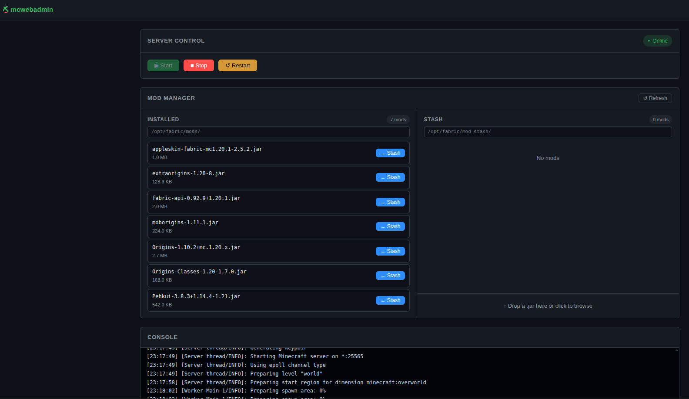

# mcwebadmin



A lightweight, single-page web management tool for self-hosted modded Minecraft (Fabric) servers running on Ubuntu 22.04.

## 🚀 Overview

`mcwebadmin` provides a secure, web-based interface to manage your Minecraft server without needing full SSH access for every task. It bridges the gap between a raw terminal/tmux session and a full-blown hosting panel.

### Core Features

-   **Server Control:** Start, stop, and restart the server via `systemd` integration.
-   **Live Console:** Real-time stream of `latest.log` via WebSockets (Socket.IO).
-   **Native Command Input:** Send commands directly to the server using the RCON protocol.
-   **Mod Stash (File Manager):** 
    -   View installed mods in `/opt/fabric/mods/`.
    -   Manage an "Available/Stashed" directory for inactive mods.
    -   Atomically move mods between active and inactive states.
    -   Direct `.jar` upload to the stash directory.
-   **World Manager:**
    -   View active/inactive world status, size, and top-level contents.
    -   Swap active and inactive worlds atomically (requires server stopped).
    -   Download either world as a ZIP archive.
    -   Upload a world ZIP into the inactive slot with overwrite confirmation.
-   **Secure by Design:** 
    -   Runs as a dedicated `mcwebadmin` system user.
    -   Path traversal protection on all file operations.
    -   Scoped `sudoers` access (limited to specific `systemctl` commands).
    -   Simple JWT-based single-user authentication.

## 🏗 Architecture

-   **Backend:** Python 3 + Flask + Flask-SocketIO (using `gevent` for async concurrency).
-   **Frontend:** React + Vite + Axios (built into static files served by Flask).
-   **Glue:** 
    -   `systemd` for process management.
    -   `RCON` for Minecraft interaction.
    -   `tail -f` logic in Python for log streaming.

## 🛠 Prerequisites

-   **OS:** Ubuntu 22.04+
-   **Server:** Minecraft Fabric server running as a service named `minecraft-fabric.service`.
-   **Python:** 3.10+
-   **Node.js:** v20+ (for building the frontend)

## 📋 Installation & Deployment

### 1. System Preparation

First, ensure your Minecraft server is located (or symlinked) at `/opt/fabric/`.

```bash
# As root
sudo mv /home/minecraft/fabric /opt/fabric
sudo ln -s /opt/fabric /home/minecraft/fabric
```

Run the provided setup script to create the `mcwebadmin` user, shared groups, and set permissions:

```bash
sudo bash scripts/setup.sh
```

### 2. Minecraft Configuration

Enable RCON in your `/opt/fabric/server.properties`:

```properties
enable-rcon=true
rcon.port=25575
rcon.password=your_strong_rcon_password_here
```

### 3. Backend Setup

```bash
cd /home/minecraft/mcwebadmin
python3 -m venv .venv
source .venv/bin/activate
pip install -r requirements.txt
```

### 4. Configuration (`.env`)

Copy the example environment file and configure your secrets:

```bash
cp .env.example .env
chmod 600 .env
```

Generate your secrets:
-   **JWT_SECRET_KEY:** `python3 -c "import secrets; print(secrets.token_hex(32))"`
-   **ADMIN_PASSWORD_HASH:** Run `python3 scripts/set_password.py` and follow the prompts.
-   **RCON_PASSWORD:** Match the password set in `server.properties`.

### 5. Frontend Build

```bash
cd frontend
npm install
npm run build
```

### 6. Service Installation

Install and start the web admin as a system service:

```bash
sudo cp mcwebadmin.service /etc/systemd/system/
sudo systemctl daemon-reload
sudo systemctl enable --now mcwebadmin
```

## 🖥 Development

To run in development mode (with hot-reloading):

1.  **Backend:** `.venv/bin/python3 run.py` (Starts on port 8080)
2.  **Frontend:** `cd frontend && npm run dev` (Starts on port 5173, proxies `/api` to 8080)

## 🔒 Security Notes

-   **Sudo Scope:** The `mcwebadmin` user is granted `NOPASSWD` sudo access specifically for `systemctl start|stop|restart|is-active` on the `minecraft-fabric.service`. It cannot run other commands as root.
-   **File Isolation:** All mod operations are strictly validated. If a filename contains `..` or does not end in `.jar`, the request is rejected with a 400 error.
-   **Authentication:** Access is protected by a single admin password (hashed via Werkzeug). 
-   **Port:** By default, the app listens on `0.0.0.0:8080`. It is recommended to use a reverse proxy (like Nginx) or a firewall to restrict access to trusted IPs.

## 🌍 World Manager Behavior

The World Manager is designed around two directories:

-   **Active world:** `/opt/fabric/world`
-   **Inactive world:** `/opt/fabric/world.inactive`

### Status and Contents

-   The UI shows whether each world directory exists, total size, and top-level entries.
-   Disk usage is also shown so you can estimate free space before uploads/downloads.

### Swap Worlds

-   Swap performs an atomic 3-step rename using a temporary directory (`world_swap_tmp`) under `/opt/fabric`.
-   The server must be stopped before swapping.
-   If neither world directory exists, swap is rejected.

### Download ZIP

-   Download creates a ZIP in `/tmp` and streams it to the browser.
-   Before each new download, previous `mcwebadmin` world temp directories in `/tmp` are removed.

### Upload ZIP (Inactive Slot)

-   Upload always targets the **inactive** slot.
-   If the inactive slot already contains data, the UI prompts for confirmation before replacing it.
-   ZIP processing flow:
    1.  Extract ZIP to a temporary staging directory in `/tmp`.
    2.  Search extracted content for a world root by locating `level.dat`.
    3.  If no valid root is found (or ambiguous roots are found), upload is rejected.
    4.  Clear existing contents of `/opt/fabric/world.inactive` (no merge).
    5.  Move the detected world root contents into `/opt/fabric/world.inactive` as top-level files/folders.

This handles ZIPs that contain an outer folder (for example `MyWorld/level.dat`) as well as flat world ZIPs.

## 📄 License

MIT

## Permissions & Ownership

To run `mcwebadmin` as the dedicated `mcwebadmin` system user and allow it to manage the server and static files, the following ownership and permission changes were made or recommended. Run these commands as a privileged user (using `sudo`) to reproduce the environment that worked here:

- Ensure the control/home directory for the service exists and is owned by the `mcwebadmin` user:

```bash
sudo mkdir -p /home/mcwebadmin
sudo chown mcwebadmin:mcwebadmin /home/mcwebadmin
sudo chmod 750 /home/mcwebadmin
```

- Make the application directory owned by the `mcwebadmin` user (recursively):

```bash
sudo chown -R mcwebadmin:mcwebadmin /home/minecraft/mcwebadmin
sudo chmod -R 750 /home/minecraft/mcwebadmin
```

- Make sure the Minecraft server and mods directories are accessible to the web admin user. Depending on your deployment and security model you can either grant group access or give `mcwebadmin` ownership of specific subpaths used for mod management:
- Make sure the Minecraft server and world/mod directories are accessible to the web admin user. The world swap operation requires write access to the parent directory (`/opt/fabric`) because it creates a temporary rename target there.

```bash
# Parent directory must be group-writable for world swap temp rename
sudo chmod 2775 /opt/fabric

# World directories should be writable by the shared group
sudo chmod 2775 /opt/fabric/world /opt/fabric/world.inactive
```

- Depending on your deployment and security model, either grant group access or give `mcwebadmin` ownership of specific subpaths used for mod/world management:

```bash
# Example: allow mcwebadmin to manage mod files
sudo chown -R mcwebadmin:mcwebadmin /opt/fabric/mods
sudo chown -R mcwebadmin:mcwebadmin /opt/fabric/mod_stash
sudo chmod -R 750 /opt/fabric/mods /opt/fabric/mod_stash

# Example: shared-group model for worlds (owner can remain minecraft)
sudo chown -R minecraft:minecraft /opt/fabric/world /opt/fabric/world.inactive
sudo chmod -R g+rwX /opt/fabric/world /opt/fabric/world.inactive
```
